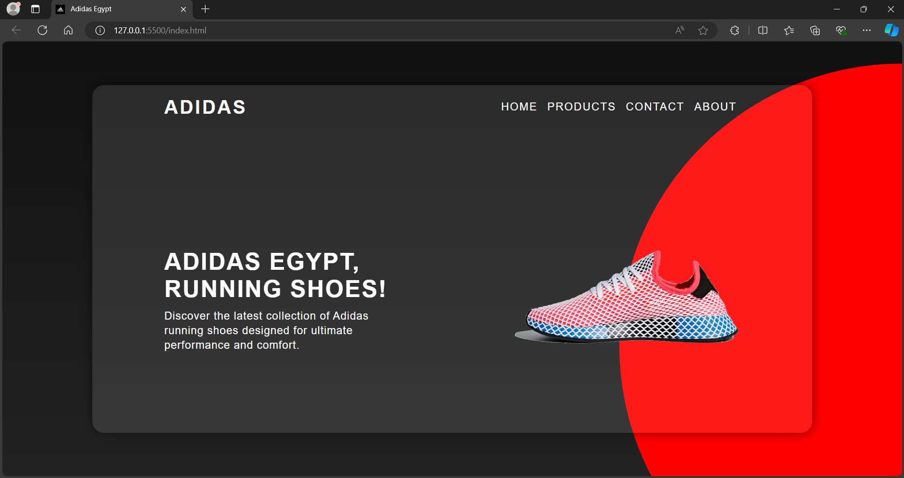
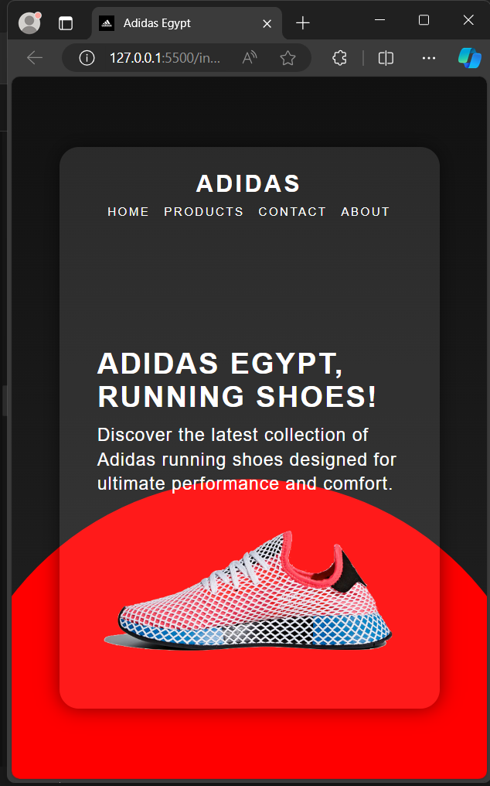

# Adidas Egypt Landing Page

This project showcases a responsive landing page for "Adidas Egypt," built using HTML and CSS. The page is designed to adapt to various screen sizes, providing an optimized user experience across desktops, tablets, and mobile devices.

## Technologies Used

- **HTML5**
- **CSS3**

## Features

- Responsive navigation bar
- Engaging content section with text and images
- Modern design with a background gradient and subtle animations

## Screenshots

### Desktop View

### Mobile View

## Author

- Mahmoud Mohamed
- Email: mahmoud.abdalaziz@outlook.com
- LinkedIn: [Mahmoud Mohamed](https://www.linkedin.com/in/mahmoud-mohamed-abd/)
---

Thank you for checking out this project! 😊
