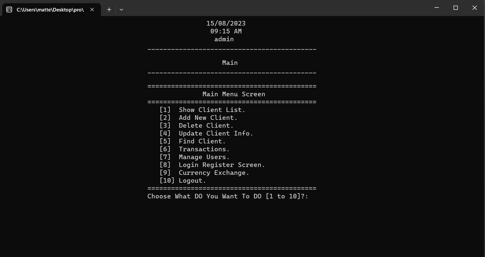
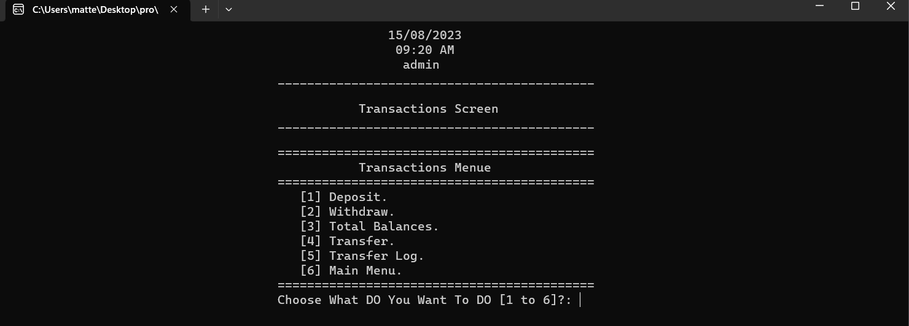

# Bank Management System

A console-based Bank Management System implemented in C++.

## Table of Contents

- [Introduction](#introduction)
- [Features](#features)
- [Getting Started](#getting-started)
  - [Prerequisites](#prerequisites)
  - [Installation](#installation)
- [Usage](#usage)
- [Credentials](#credentials)
- [Contributing](#contributing)
- [Code Review](#Code-Review)
- [Note](#Note)
- [Very Important Note](#Very-Important-Note)
- [Screenshots](#Screenshots)
- [Author](#Author)
- [License](#license)

## Introduction

This project is a console-based Bank Management System implemented in C++. It provides basic banking operations such as creating, updating, and deleting clients, managing user accounts, performing transactions, and more.

The program provides a command-line interface where users can interact with the system. It displays a main menu with options for different operations. Users can choose the desired operation by entering the corresponding menu number.

The client records are stored in a structured format, where each record represents a client and contains fields such as account number, PIN code, name, phone number, and account balance. The records are read from and written to the `Clients.txt` file using a specific delimiter ("#//#") to separate the fields.

the project is very big program and it doesn't a small project it contains A lot of features and programmatic logic 
the program is a simulation of the original large programs of banks, it really does everything that these programs do, except that my program is for training only and nothing else

## Features

- User Login and Authentication
- Client Management (Add, Update, Delete, List, Search)
- User Management (Add, Update, Delete, List, Search)
- Transaction Management (Deposit, Withdraw, Transfer, Transfer Log)
- Currency Exchange
- Access Control and Permissions

- **Login interface**: The program now includes a login interface. To access the main screen, you must enter the username and password registered in the database, which is a text file (Flat File Database). User credentials are stored in a text file named "Users.txt" attached to the program files.

- **User roles and permissions**: Each user is assigned a specific role, with the administrator having full capabilities such as editing customers, deleting, adding, and comprehensive control over user data and permissions. Other users may have one or more specific permissions tailored to their role.

- **Flexibility to modify user permissions**: You can modify user permissions by logging in as an admin. Administrators have the flexibility to modify user permissions either through the program interface or by directly editing the "Users.txt" file (not recommended). It's important to note that manual modification of the file is discouraged. Modifying user permissions through the program interface ensures data integrity and reduces the risk of potential errors.

- **User data storage**: User data is stored in the "Users.txt" file. Each user's information is organized in a structured format using the "##" delimiter to separate the fields. The file follows the structure: 
`firstName#//#lastName#//#email#//#phone#//#username#//#password#//#permissions`.

## Getting Started

### Prerequisites

- C++ Compiler (e.g., g++)
- Git (optional)

### Installation

1. Clone the repository:

```bash
git clone https://github.com/mattar740/bank-management-system.git
```
-  Alternatively, you can download the project as a ZIP file and extract it.

1. Navigate to the project directory:
```bash
cd bank-management-system
```
2. Compile the source code using your C++ compiler:

```bash
g++ main.cpp -o BankManagementSystem
```

## Usage

1. Run the compiled executable:
```bash
./BankManagementSystem
```

2. Log in using the provided credentials:

Username: admin
Password: admin

3. Follow the on-screen instructions to navigate through the various menu options and perform banking operations.


## Credentials

- Use the following credentials to log in with full access:

Username: admin
Password: admin

## Code Review

- the project is very big program and it doesn't a small project 
- The program provides various helper functions to handle input validation, string manipulation, file operations, and data manipulation.
- The main functionality is divided into separate functions for each operation, such as adding clients, updating clients, deleting clients, finding clients, and performing transactions.
- The program uses a vector to store and manipulate client records in memory.
- The code includes error handling for file operations, invalid input, and transaction processing.

## Note
This project serves as a comprehensive exercise to showcase various programming concepts and techniques. While it simulates the functionality of real bank management systems, it is designed for educational purposes and is not intended for production use. Advanced security measures and additional features necessary for real-world applications are not included. Use this project as a learning resource and feel free to adapt and expand upon it as needed for your own projects.

The project assumes a specific format for the `Clients.txt` file, where each line represents a client record with fields separated by "#//#". Any changes to the file format may require modifications in the code.

Please note that this code does not include error handling for all possible scenarios, and it assumes the input data is well-formed. You may need to enhance the code based on your specific requirements and use cases.

Feel free to modify and adapt the code to suit your needs. If you have any further questions, please let me know!

## Very Important Note

This Client Management System project is a training exercise designed to demonstrate OOP programming skills and concepts. It is not intended to be used as a real-world application and may not include advanced features or security measures required for production systems.

the project is very big program and it doesn't a small project it contains A lot of features and programmatic logic 
the program is a simulation of the original large programs of banks, it really does everything that these programs do, except that my program is for training only and nothing else

## Screenshots

Here are some screenshots of the Bank Management System in action:

1. [Main Menu](screenshots/4_MainMenu.png)
   
   
2. [Transactions](screenshots/10_Transactions.png)
   
   
3. [Manage Users](screenshots/11_Manage_Users.png)
   

And many more screenshots are available in the [screenshots](screenshots/) directory.

Feel free to explore the screenshots to get a visual overview of the program's features.

## Author

- Mahmoud Mohamed
- Email: mahmoud.abdalaziz@outlook.com
- LinkedIn: [Mahmoud Mohamed Abdalaziz](https://www.linkedin.com/in/mahmoud-mohamed-abd/)


## License

This project is licensed under the MIT License - see the [LICENSE](LICENSE) file for details.

